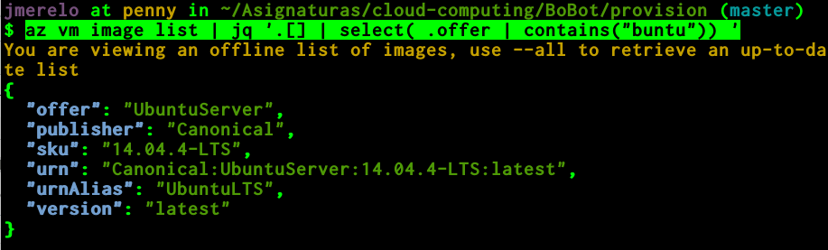

Automatización de tareas en la nube
==

<!--@
prev: Almacenamiento
next: Automatizando_cloud
-->

<h2>Objetivos</h2>

1.   Conocer las diferentes tecnologías y herramientas de
virtualización tanto para procesamiento, comunicación y
almacenamiento. 

2. Diseñar, construir y analizar las prestaciones de un centro de
proceso de datos virtual. 

3. Documentar y mantener una plataforma virtual.

4. Realizar tareas de administración de infraestructuras virtuales.

Introducción
------------------

El objetivo de las plataformas de virtualización es, eventualmente,
crear y gestionar una máquina virtual completa que funcione de forma aislada 
del resto del sistema y que permita trabajar con sistemas
virtualizados de forma flexible, escalable y adaptada a cualquier
objetivo. Eventualmente, el objetivo de este este tema es aprender a
crear
[infraestructura como servicio tal como vimos en el primer tema](Intro_concepto_y_soporte_fisico.md). Para
ello necesitamos configurar una serie de infraestructuras virtuales,
especialmente
[almacenamiento como se vio en el tema anterior](Intro_concepto_y_soporte_fisico).

Los programas que permiten crear infraestructuras virtuales completas
se denominan
[hipervisores](http://en.wikipedia.org/wiki/Hypervisor). Un hipervisor
permite manejar las diferentes infraestructuras desde línea de órdenes
o mediante un programa, y a su vez se habla de dos tipos de
hipervisores: los de *tipo I* o *bare metal* que se ejecutan
directamente sobre el hardware (es decir, el sistema arranca con
ellos) y los de *tipo II* o *alojados*, que se ejecutan dentro de un
sistema operativo tradicional como un módulo del núcleo o simplemente
un programa. En muchos casos la diferencia no está clara, porque hay
hipervisores que son distribuciones de un sistema operativo con
módulos determinados y por lo tanto de Tipo II (si consideramos el
módulo) o de Tipo I (si consideramos el sistema operativo completo),
y en todo caso la distinción es más académica que funcional; en la
práctica, en la mayoría de los casos nos vamos a encontrar con
hipervisores alojados que se ejecutan desde un sistema operativo.

Para apoyar la virtualización, casi todos los procesadores actuales y
especialmente [los de las líneas más populares basadas en la arquitectura x86 tienen una serie de instrucciones que permiten usarla de manera segura y eficiente](http://en.wikipedia.org/wiki/X86_virtualization). Esta
arquitectura tiene dos ramas: la Intel y la AMD, cada uno de los
cuales tiene un conjunto de instrucciones diferentes para llevarla a
cabo. Aunque la mayoría de los procesadores lo incluyen, los
portátiles de gama baja y algunos ordenadores de sobremesa antiguos no
la incluyen, por lo que habrá que comprobar si nuestro procesador lo
hace. Si no lo hiciera, se habla de
[paravirtualización](http://en.wikipedia.org/wiki/Paravirtualization)
en la que los hipervisores tienen que *interpretar* cada imagen del
sistema operativo que alojan (llamado *invitado*) y convertirla en
instrucciones del que aloja (llamado *anfitrión* o *host*). La mayor
parte de los hipervisores, como
[Xen](http://en.wikipedia.org/wiki/Xen) o [KVM](http://en.wikipedia.org/wiki/Kernel-based_Virtual_Machine) incluyen
también la capacidad de paravirtualizar ciertos sistemas operativos en
caso de que los anfitriones no tengan soporte; por ejemplo, KVM se ha
asociado con [QEMU](http://en.wikipedia.org/wiki/QEMU) que lo usa en
caso de que el procesador tenga soporte. 

Por encima de los hipervisores están los sistemas de gestión de
máquinas virtuales en la nube que, aunque se puedan usar desde las
mismas herramientas y con el mismo cometido, en realidad abstraen el
trabajo del hipervisor y permiten trabajar con un API uniforme
independientemente del hipervisor real que esté por debajo. Estos
sistemas de gestión de máquinas virtuales pueden ser libres, como
OpenStack u OpenNebula, o privativos, como los que se usan en la
mayoría de los sistemas de la nube. Todos, sin embargo, permiten
realizar una serie de tareas que veremos a continuación. 

## Pasos a dar para creación de una instancia en la nube

Aunque los proveedores de nube usan mecanismos diferentes, en realidad
los pasos a dar son muy parecidos, lo que evidentemente es un paso
para que luego se automatice con un interfaz uniforme. Para echar a
andar una instancia, o máquina virtual, en la nube, habrá que hacer
los siguientes pasos

1. Localizar la imagen que deseamos. Esta imagen contendrá el sistema
   operativo, así como alguna utilidad adicional que nos permita
   trabajar fácilmente con sistemas de aprovisionamiento o configurar
   alguna otra cosa. Para ello, suelen tener imágenes o *plantillas*
   que se pueden usar de forma directa, algunas de ellas *oficiales* o
   proporcionadas por los que publiquen el sistema operativo. Antes de
   crear una instancia de la máquina virtual habrá que buscar la forma
   de identificar estas imágenes para crear la instancia con ellas.

2. Crear metadatos relativos a la instancia de la máquina
   virtual. Cosas como el *grupo de recursos*, que indica cómo va a
   escalar, el centro de datos en el que se va a alojar, y alguna cosa
   adicional, como el tipo de instancia que se va a usar.

3. Crear una forma automática de acceder a la máquina virtual,
   generalmente mediante generación y copia a la instancia en
   funcionamiento de la clave pública cuyo par está bajo tu
   control. Dependiendo del sistema, se tendrá que hacer "a mano" o
   usará las claves ya disponibles.

4. Acceso a la propia máquina virtual en funcionamiento,
   principalmente la consola y también a los registros, así como los
   metadatos.

Todas las plataformas suelen tener una utilidad de línea de órdenes, o
varias, que permite acceder al API de la misma una vez identificados
ahí. Generalmente son libres, así que también se pueden usar desde tu
propio programa. A continuación veremos como trabajar en alguna de
ellas. 

Trabajando con máquinas virtuales en la nube
----

Vamos a ver cómo funcionan algunas de estas utilidades de línea de
órdenes, empezando por el CLI de Azure clásico, luego el moderno, y
más adelante el de OpenStack

### CLI de Azure (clásico)

>Tendrás que instalártelo, previa instalación de node.js, que es en lo
>que está basado. `npm install -g azure-cli` bastará. 

Azure permite,
[tras la creación de almacenamiento virtual](Almacenamiento.md), la
creación de máquinas virtuales, como es natural. Se puede crear una
máquina virtual desde el panel de control, pero también desde
la [línea de órdenes](https://github.com/WindowsAzure/azure-sdk-tools-xplat). Primero
hay que saber qué imágenes hay disponibles:

	azure vm image list

Por ejemplo, se puede escoger la imagen
`b39f27a8b8c64d52b05eac6a62ebad85__Ubuntu_DAILY_BUILD-trusty-14_04-LTS-amd64-server-20131221-en-us-30GB`
de una versión LTS de Ubuntu o de otra como la
`b39f27a8b8c64d52b05eac6a62ebad85__Ubuntu-13_10-amd64-server-20131215-en-us-30GB`
Con

	azure vm image show b39f27a8b8c64d52b05eac6a62ebad85__Ubuntu-13_10-amd64-server-20131215-en-us-30GB
	
nos muestra detalles sobre la imagen; entre otras cosas dónde está
disponible y sobre si es Premium o no (en este caso no lo es). Con
esta (o con otra) podemos crear una máquina virtual

	azure vm create peasomaquina b39f27a8b8c64d52b05eac6a62ebad85__Ubuntu-13_10-amd64-server-20131215-en-us-30GB peasousuario PeasoD2clav= --location "West Europe" --ssh

En esta clave tenemos que asignar un nombre de máquina (que se
convertirá en un nombre de dominio `peasomaquina.cloudapp.net`, un
nombre de usuario (como `peasousuario`) que será el superusuario de la
máquina, una clave como `PeasoD2clav=` que debe incluir mayúsculas,
minúsculas, números y caracteres especiales (no uséis esta, hombre),
una localización que en nuestro caso, para producción, será
conveniente que sea *West Europa* pero que para probar podéis
llevárosla a la localización exótica que queráis y, finalmente, para
poder acceder a ella mediante ssh, la última opción, si no no tengo
muy claro cómo se podrá acceder. Una vez hecho esto, conviene que se
cree un par clave pública/privada y se copie al mismo para poder
acceder fácilmente.

La máquina todavía no está funcionando. Con `azure vm list` nos
muestra las máquinas virtuales que tenemos y el nombre que se le ha
asignado y finalmente con `azure vm start` se arranca la máquina y
podemos conectarnos con ella usando `ssh` Una de las primeras cosas
que hay que hacer cuando se arranque es actualizar el sistema para
evitar problemas de seguridad. A partir de ahí, podemos instalar lo
que queramos. El arranque tarda cierto tiempo y dependerá de la
disponibilidad de recursos; evidentemente, mientras no esté arrancada
no se puede usar, pero conviene de todas formas apagarla con 

	azure vm shutdown maquina
	
cuando terminemos la sesión y no sea necesaria, sobre todo porque,
dado que se pagan por tiempo de uso, se puede incurrir en costes
innecesarios. 

Crear una máquina virtual Ubuntu e instalar en ella un servidor
nginx para poder acceder mediante web.

Trabajar con estas máquinas virtuales como si se tratara de máquinas
reales no tiene mucho sentido. El uso de infraestructuras virtuales,
precisamente, lo que permite es automatizar la creación y
provisionamiento de las mismas de forma que se puedan crear y
configurar máquinas en instantes y personalizarlas de forma
masiva. Veremos como hacerlo en el
[siguiente tema](Gestion_de_configuraciones).

### Usando el nuevo CLI de Azure

El
[nuevo CLI de Azure](https://github.com/Azure/azure-cli#installation)
está basado en Python y se puede instalar siguiendo las instrucciones
arriba. Es bastante similar al anterior, pero hay muchas tareas que se
realizan mucho más fácilmente usando valores por omisión relativamente
fáciles. Además, devuelve los resultados en JSON por lo que es
relativamente fácil trabajar con ellos de forma automática.

Comencemos por crear un grupo de recursos

	az resource group create -l westeurope -n CCGroupEU

Esto crea un grupo de recursos en Europa Occidental. Vamos a usarlo
más adelante para crear nuestras instancias.

	az vm image list

Te devolverá el grupo de máquinas virtuales disponibles. Pero, como se
ha dicho antes, te lo devuelve en JSON, con lo que es conveniente
filtrarlo. Para ello usaremos el tremendamente útil `jq`,
[un lenguaje de peticiones para JSON](https://stedolan.github.io/jq/manual/)
con cierta similitud con los selectores CSS.

> Si se añade `--all` te devolverá todas las imágenes disponibles,
> pero ahora mismo hay un
> [bug registrado](https://github.com/Azure/azure-cli/issues/1209)
> porque no se pueden usar en realidad con la línea de órdenes. Así
> que nos ceñiremos a las imágenes disponibles localmente.

	az vm image list | jq '.[] | select( .offer | contains("buntu"))'

Esta te filtrará sólo aquellas imágenes que contengan `buntu` (no
sabemos si va a estar en mayúsculas o minúsculas), devolviendo algo
así:

De esta imagen hay que usar dos IDs: `urn` y `urnAlias`, que nos
permitirán identificar la imagen con la que vamos a trabajar a
continuación:

	az vm create -g CCGroupEU -n bobot --image UbuntuLTS

En este caso creamos la máquina virtual llamada `bobot` con una imagen
de UbuntuLTS y `az` usa una clave SSH pública de nuestro directorio y
nuestro nombre de usuario para copiarlo directamente a la instancia
creada. Puede tardar un rato en crear la instancia, eso sí, pero
devolverá un JSON que incluirá metadatos y su IP pública como
`publicIpAddress`. Una vez hecho eso, te puedes conectar directamente
a ella con su dirección IP y ssh.

Una vez que se deje de usar, conviene pararla con

	az vm stop -g CCGroupEU -n bobot

Si no, seguirá disminuyendo el crédito.

Crear una instancia de una máquina virtual Debian y provisionarla
usando alguna de las aplicaciones vistas en
[el tema sobre herramientas de aprovisionamiento](Gestion_de_configuraciones)

## CLI de OpenStack

[OpenStack](http://docs.openstack.org) es un sistema libre de gestión
de nubes privadas que se ha hecho muy popular incluso en revendedores
de sistemas como IBM u otros, que en realidad ofrecen este tipo de
acceso. Se puede probar en alguna instalación disponible en la
Facultad o Escuela o bien en [TryStack](http://trystack.org) si te admiten.

Como arriba, hay también un
[sistema de línea de órdenes](http://docs.openstack.org/user-guide/cli.html),
inicialmente uno para cada uno de los subsistemas de OpenStack pero
últimamente unificado a una sola orden, `openstack`. Para trabajar con
él, tras descargar el cliente, hay que
[configurar una serie de variables de entorno descargándose un fichero](http://docs.openstack.org/user-guide/common/cli-set-environment-variables-using-openstack-rc.html),
que él mismo pone las API keys y demás. Una vez ejecutado ese *script*
de configuración se puede, por ejemplo, crear una clave para acceder
a las instancias que se vayan a crear 

	nova keypair-add Try > openstack-key.pem

que crea una clave llamada `Try` y la guarda en un fichero de clave
privada.

Sin embargo, al menos en esta instalación de prueba, es más fácil
trabajar con el interfaz gráfico que con la línea de órdenes. En
[este tutorial](https://github.com/naturalis/openstack-docs/wiki/Howto:-Creating-and-using-OpenStack-SSH-keypairs-on-Linux-and-OSX)
te explica cómo crear el par de claves. Una vez creada

* Hay que añadir el puerto 22 de ssh al grupo de seguridad que se vaya
  a usar

* Se tiene que crear una red y una subred para conectar la instancia a
  la subred.

* Se tiene que crear un *router* al cual se conecta la red

* Finalmente, se crea la instancia. Esto sí se puede hacer desde línea
  de órdenes

	openstack server create --flavor m1.smaller --image Ubuntu16.04 \
	  --nic net-id=b96fdf8d-99ca-3333-5555-38ccd03a4a3c \
	  --security-group default --key-name Try bobot-x

* La orden anterior crea una instancia llamada `bobot-x` con una
  imagen de Ubuntu (una de las que hay por defecto) y una red cuyo ID
  se extrae desde el interfaz gráfico. El *flavor* es el tipo de
  instancia, esta es una de las que hay disponibles.

* Una vez creada la instancia, se le asigna una IP flotante para poder
  acceder desde fuera, teóricamente de esta forma, aunque da error
  (*Conflict*) al menos a mi

	openstack floating ip create b96fdf8d-99ca-3333-5555-38ccd03a4a3c

* Si eso falla, se puede asignar una IP flotante desde el interfaz
  gráfico, yendo a la lista de instancias. 

Conseguir una cuenta de prueba en OpenStack y crear una instancia a la
que se pueda acceder, provisionándola con algún *script* disponible. 

A dónde ir desde aquí
-----

Si no lo has visto, en el [siguiente tema](Gestion_de_configuraciones) pondremos en
práctica todos los conceptos aprendidos en este tema y
[en el tema dedicado a almacenamiento](Almacenamiento) para crear configuraciones que sean
fácilmente gestionables y adaptables a un fin determinado.

Si lo que necesitas es un sistema ligero de virtualización, puedes
mirar cómo virtualizar con [contenedores](Contenedores.mv).

